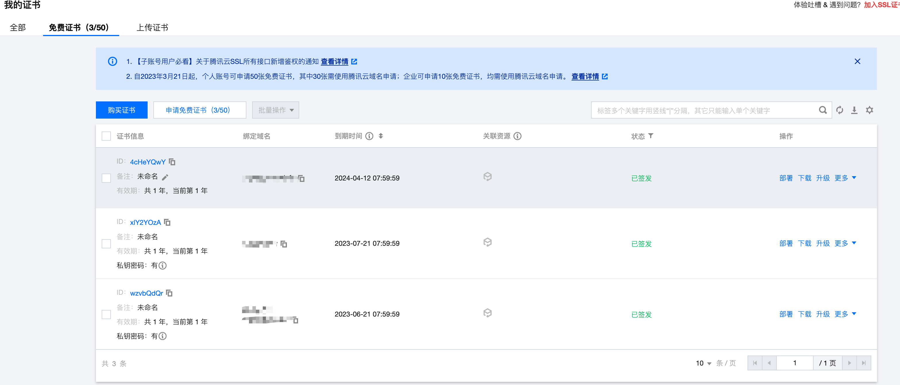
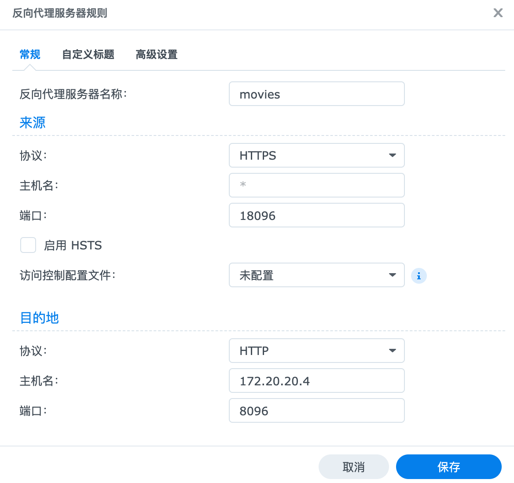

> SSL 证书对于网站的安全和可信度至关重要，但很多小站长都因为成本和技术等方面的原因没有启用 SSL 证书。本文将介绍如何使用群晖 920+结合腾讯云 DNSPod 实现 https 访问，供更加安全和可信的保障。

## 2：申请域名和证书

域名可以在任何一个域名商注册，这里只演示申请证书。

- 1. 打开[控制台](https://console.cloud.tencent.com/ssl)点击申请免费证书,填写完信息后提交申请等一小会就申请下来了
     
     在证书列表后找到下载证书,一般都是选择 Nginx 类型。

## 3：安装证书到群晖 920+

打开群晖后台->安全性->证书，点击新增->添加新证书->导入证书,按照对应的信息填写完成即可,私钥为证书文件夹中.key 结尾的文件,证书为证书文件夹中.pem 结尾的文件.然后设置所有服务使用证书为新增证书.

## 4：配置反向代理与开启 HTTPS

- 开启 HTTPS：
  打开群晖后台->登录门户,把`自动将DSM桌面的HTTP连接重定向到HTTPS`选项钩上保存.
- 配置反向代理
  打开群晖后台->登录门户->高级->反向代理服务器
  
